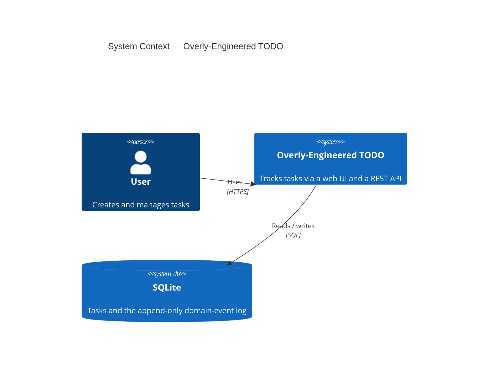
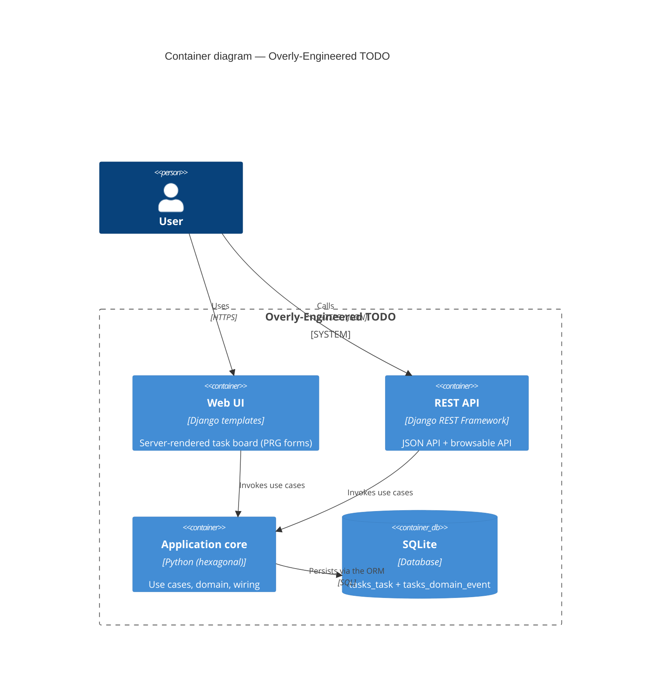
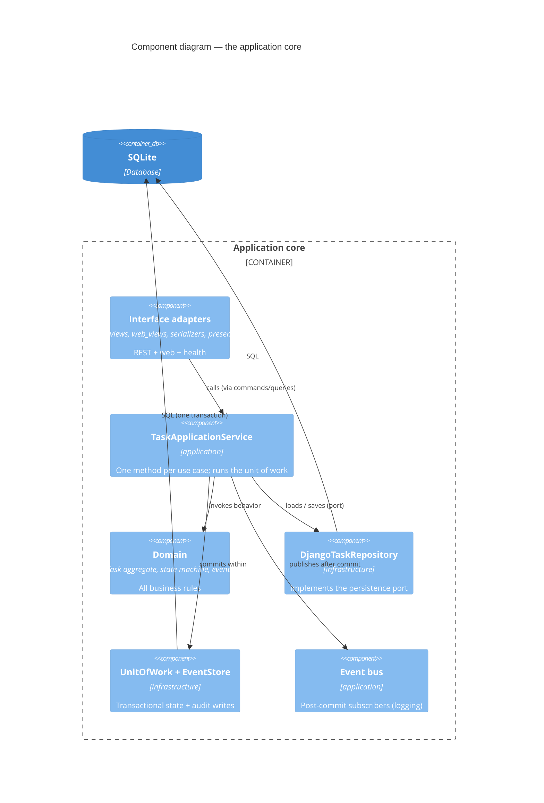
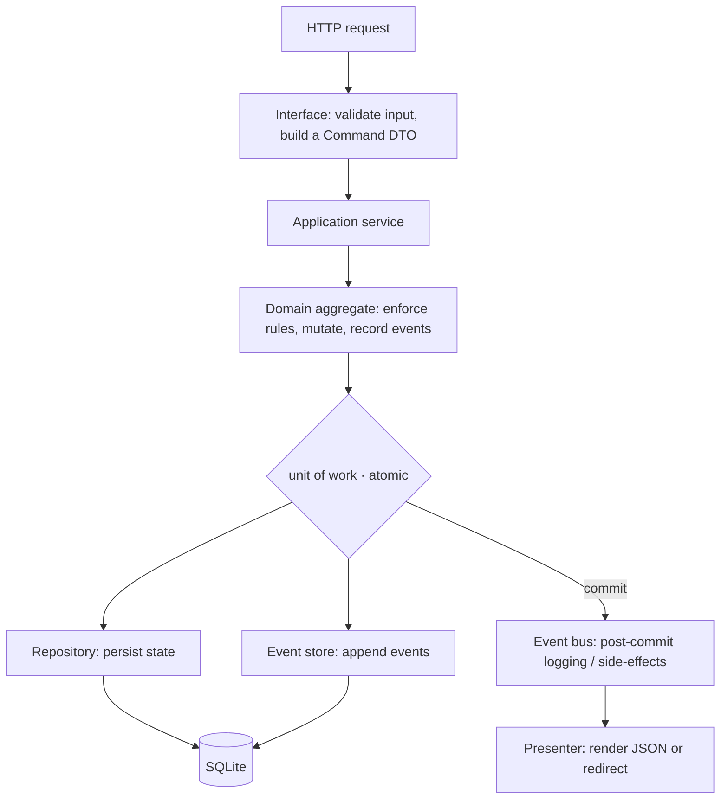

# Architecture diagrams (C4)

These are [C4-model](https://c4model.com/) views — Context, Container, Component —
rendered with Mermaid (they display inline on GitHub and in the docs site). Read
them alongside [ARCHITECTURE.md](ARCHITECTURE.md), which is the prose reference.

## Level 1 — System context

*Who uses the system and what it depends on.*

## Level 2 — Containers

*The runtime pieces inside the system.* Both transports are thin adapters over the
**one** application core.

## Level 3 — Components (inside the application core)

*How the layers fit together.* Dependencies point inward toward the framework-free
domain; the `import-linter` contracts enforce exactly these arrows.

## The request lifecycle

*One mutating request, end to end* (see also
[ARCHITECTURE.md](ARCHITECTURE.md#request-lifecycle)).

